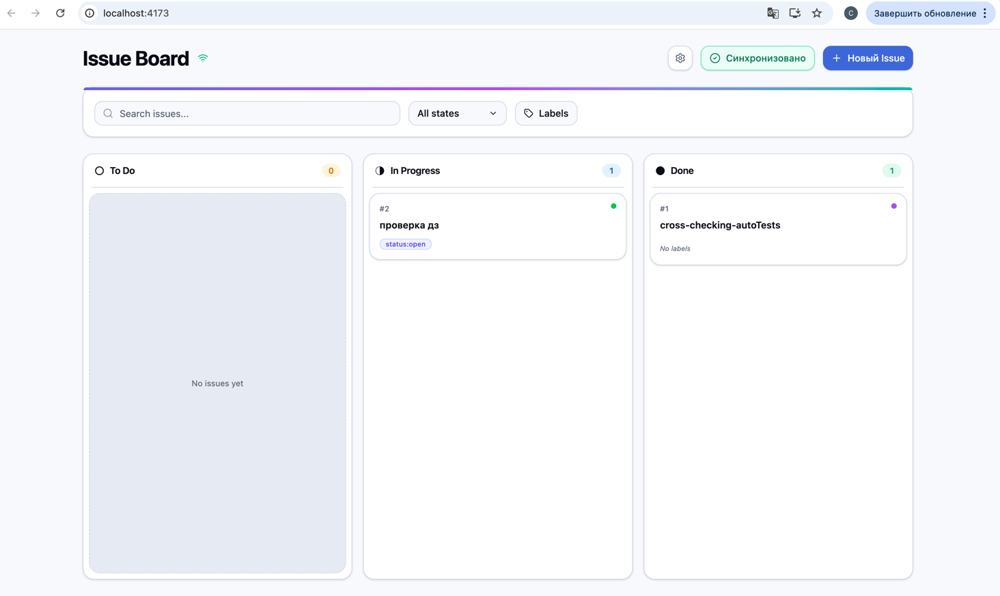

# Issue Board

Веб-приложение для управления GitHub Issues в формате канбан-доски с поддержкой drag & drop, оффлайн-режима и двусторонней синхронизации с GitHub API.



## Список технологий

| Технология | Версия | Назначение |
|---|---|---|
| React | 19.2 | UI-библиотека |
| TypeScript | 5.9 | Типизация |
| Vite | 7.3 | Сборщик |
| Tailwind CSS | 4.2 | Стилизация |
| Zustand | 5.0 | Стейт-менеджмент |
| React Router | 7.13 | Маршрутизация |
| TanStack React Query | 5.90 | Асинхронные запросы и мутации |
| @dnd-kit/react | 0.3 | Drag & Drop |
| React Hook Form + Zod | 7.71 / 4.3 | Формы и валидация |
| vite-plugin-pwa | 1.2 | PWA / Service Worker |
| Lucide React | 0.577 | Иконки |

## Памятка по запуску

### Предварительные требования

- Node.js 18+ и npm

### Установка и запуск

```bash
# 1. Клонировать репозиторий
git clone https://github.com/stefashka2810/IssueBoard.git

# 2. Установить зависимости
npm install

# 3. Собрать проект и запустить
npm run build
npm run preview
```

Приложение откроется на `http://localhost:4173`.

### Настройка GitHub-синхронизации

1. Перейти в **Settings** (иконка шестерёнки на доске)
2. Ввести имя репозитория в формате `owner/repo` (например `stefashka2810/IssueBoard`)
3. Ввести [GitHub Personal Access Token](https://github.com/settings/tokens) с правами `repo`
4. Нажать «Сохранить» и вернуться на доску
5. Нажать кнопку синхронизации ↻

## Документация

Подробный отчёт о технологиях и проделанной работе — в [REPORT.md](./REPORT.md).
